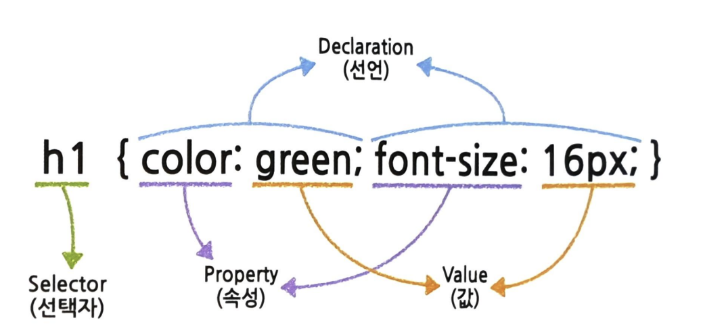
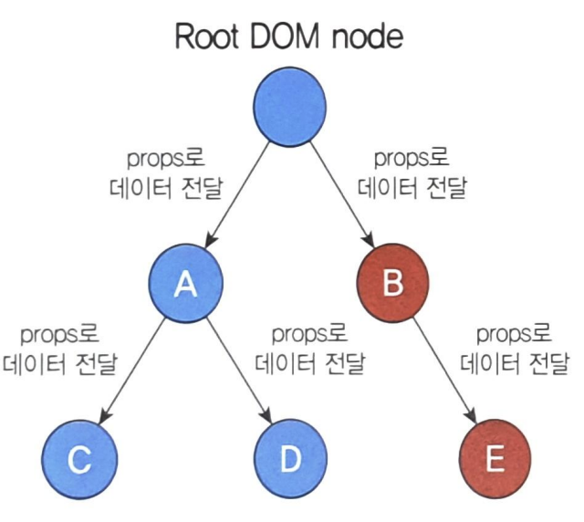
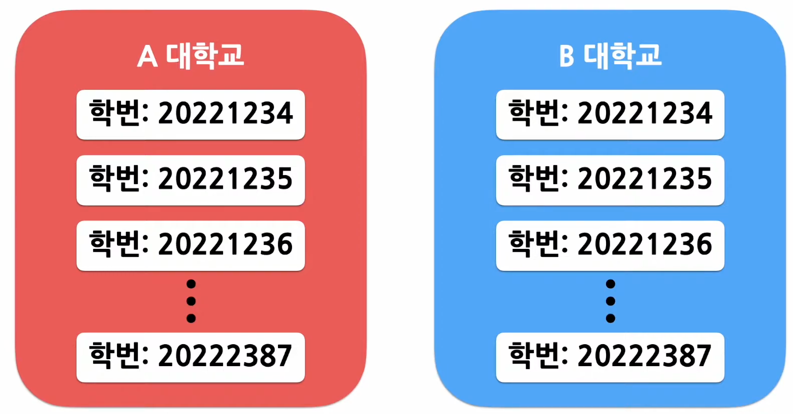

# 김준석 202030207  

## 6월 12일 강의 내용
### CSS란?
- CSS는 스타일링을 위한 언어
- 엘리먼트에 스타일이 적용되는 규칙을 선택자라고 한다
- CSS는 선택자와 스타일로 이루어져 있다
- 선택자를 먼저 쓰고 다음에 적용할 스타일을 세미콜론으로 구분하여 하나씩 작성한다
- 작성방법


### 레이아웃과 관련된 속성들
#### display
- 화면에 엘리먼트를 어떻게 배치할 것 인가
- 가장 중요한 속성임
- 모든 엘리먼트들은 display 속성을 다 갖고 있지만 기본 값 변경이 가능하다

##### visibility
- 엘리먼트의 가시성을 말한다
- 엘리먼트를 화면에 보여주거나 감추기 위해 사용한다

#### position
- 엘리먼트를 어디에 위치시킬 것인지를 정의하기 위해 사용한다

#### 플렉스 박스
- CSS의 레이아웃 사용의 불편한 부분을 개선하기 위해 등장했다
- 컨테이너, 아이템으로 이루어져 있다

#### 폰트 관련 속성
- 글꼴과 관련된 속성


## 6월 11일 강의 내용
### Specializtion(특수화, 전문화)
- 범용적인 개념을 구별이 되게 구체화하는 것을 특수화라고 함
- 객체지향 언어에서는 상속을 사용하여 특수화를 구현함
- 리액트에서는 합성을 사용하여 특수화를 구현

### Containment + Specializtion 같이 사용하기
- Containment를 위해서 props.children을 사용하고, Specializtion을 위해 직접 정의한 props를 사용하면 된다

### 리액트에서의 상속
- 자식 클래스는 부모 클래스가 가진 변순 함수 등의 속성을 모두 갖게 되는 개념
- 하지만 리액트에서는 상속보다 합성을 통해 새로운 컴포넌트를 생성
- **"복잡한 컴포넌트를 쪼개 여러개의 컴포넌트로 만들고 만든 컴포넌트들을 조합하여 새로운 컴포넌트를 만들자"**

### 컨텍스트
- 기존에 리액트는 데이터를 컴포넌트의 props를 통해 부모에서 자식으로 단방향으로 전달함
- 컨텍스트는 리액트 컴포넌트들 사이에서 데이터를 기존의 props를 통해 전달하는 방식대신 '컴포넌트 트리를 통해 곧바로 컴포넌트에 전달하는 방식'을 제공함
- 컨텍스트를 사용하면 일일이 props로 전달할 필요 없이 그림처럼 데이터를 필요로 하는 컴포넌트에 곧바로 전달할 수 있다₩


### 언제 컨텍스트를 사용해야 할까
- 여러 컴포넌트에서 계속해서 접근이 일어날 수 있는 데이터가 있는 경우
- 반복적인 코드를 계속해서 작성해 주어야 하기 때문에 비효율적이고 가독성이 떨어진다
- 컨텍스트를 사용하려면 이러한 방식을 깔끔하게 개선할 수 있다
- React.createContext()함수를 사용하여 ThemeContext라는 이름의 컨텍스트를 생성함

### 컨텍스트를 사용하기 전에 고려해야할 부분
- 컨텍스트는 다른 레벨의 많은 컴포넌트가 특정 데이터를 필요로 하는 경우에 사용
- 컴포넌트와 컨텍스트가 연동되면 재사용성이 떨어지게 된다(주의)
- 다른 레벨의 많은 컴포넌트가 데이터를 필요로 하는 경우가 아니면 props를 통해 데이터를 전달하는 합성 방법이 더 적합

### 컨텍스트 API
- React.createContext
    ```js
    const MyContext = React.createContext(기본값)
    ```

### Context.Provider
- Context.Provider 컴포넌트로 하위 컴포넌트들을 감싸주면 모든 하위 컴포넌트들이 해당 컨텍스트의 데이터에 접근할 수 있다
    ```js
    <MyContext.Provider value={/*some value*/}>
    ```
- Provider 컴포넌트에는 value라는 prop이 있고 이것은 Provider 컴포넌트 하위에 있는 컴포넌트에 전달
- 하위 컴포넌트를 consumer 컴포넌트라고 한다

### useContext
- 함수형 컴포넌트에서 컨텍스트를 사용하기 위해 컴포넌트를 매번 Consumer 컴포넌트로 감싸주는 것보다 좋은 방법이 있다
- 바로 Hook을 사용하는 것이다

### useState vs useContext
- useState: 로컬(해당 컴포넌트)에 있는 상태를 관리하는 것
- useContext: 전역적으로 하위 컴포넌트에 대해서도 사용할 수 있게 하는 것

## 6월 5일 강의 내용
### shared state
- 공유된 컴포넌트, 자식 컴포넌트들이 가장 가까운 부모 컴포넌트의 state를 공유해서 사용하는 것
- 어떤 컴포넌트의 state에 있는 데이터를 여러 개의 하위 컴포넌트에서 공통적으로 사용하는 경우

### state 끌어올리기
- 하위 컴포넌트의 state를 공통된 부모 컴포넌트로 끌어올려서 공유하는 방식

### 합성(Composition)
- 여러 개의 컴포넌트를 합쳐서 새로운 컴포넌트를 만드는 것

### Containment
- 하위 컴포넌트를 포함하는 형태의 합성 방법
- 컴포넌트에 따라서 어떤 자식 엘리먼트가 들어올 지 미리 예상할 수 없는 경우가 있다
- 범용적인 '박스' 역할을 하는 사이드바, 다이얼로그와 같은 컴포넌트에서 자주 볼 수 있다

## 5월 29일 강의 내용
### 폼
- 사용자로부터 입력 받기 위해 사용하는 것
### 제어 컴포넌트
- 사용자가 입력한 값에 접근하고 제어할 수 있도록 해주는 컴포넌트
- 값이 리액트의 제어를 받는 입력 폼 엘리먼트를 의미한다

### textarea
- 여러줄에 텍스트를 입력받기 위한 태그

### select
- 드롭다운 메뉴를 보여주기 위한 태그

### file input
- file 태그는 읽기 전용이므로 리액트에선 비제어 컴포넌트가 된다

## 5월 22일 강의 내용
### 리스트?
- 같은 아이템을 순서대로 모아놓은 것
### 키?
- 각 객체나 아이템을 구분할 수 있는 고유한 값
### 여러 개의 컴포넌트 렌더링
- 자바스크립트 배열의 map() 함수 사용의 예
    ```js
    const double = numbers.map((number) => number * 2)
    ```
- 배열에 들어있는 각 변수에 어떤 처리를 한 뒤 결과(엘리먼트)를 최종 결과를 배열로 만들어서 리턴
- map() 함수안에 있는 엘리먼트는 꼭 키가 필요함
- 리액트 map() 함수 사용의 예
    ```js
    const numbers = [1,2,3,4,5]
    const listItems = numbers.map((number) => <li>{number}</li>)

    ReactDOM.render (
        <ul>{listItem}</ul>
        document.getElementById('root')
    )
    ```
### 리스트와 키
#### 키
- 리스트에서 아이템을 구분하기 위한 고유한 문자열
- 리스트에서 어떤 아이템이 변경, 추가 또는 제거 되었는지 구분하기 위해 사용
- 리액트에서는 키의 값은 같은 리스트에 있는 엘리먼트 사이에서만 고유한 값이면 됨(두 List 사이에서는 key가 같아도 상관없다)
- 예시


## 5월 8일 강의 내용
### Arguments 전달하기
- 함수를 정의할 때는 파라미터 혹은 매개변수, 함수를 사용할 때는 아규먼트 혹은 인수 라고 부른다.
- 이벤트 핸들러에 매개변수를 전달해야하는 경우도 많다.
- 클래스 컴포넌트
    - 화살표 함수를 사용하거나 function.prototype.bind를 사용해서 전달
- 함수 컴포넌트
    - 이벤트 핸들러 호출시 원하는 순서대로 매개변수를 넣어서 사용

### 조건부 렌더링
#### 조건부 렌더링이란?
- 조건에 따라 렌더링의 결과가 달라지도록 하는 것
#### 엘리먼트 변수
- 리액트 엘리먼트를 변수처럼 저장해서 사용하는 방법
#### 인라인 조건
- 조건문을 코드 안에 집어넣는 것
- 인라인 if
    - if문을 필요한 곳에 직접 집어넣어서 사용하는 방법
    - 논리연산자 &&를 사용(AND 연산)
    - 앞에 나오는 조건문이 true 일 경우에만 뒤에 나오는 엘리먼트를 렌더링
- 인라인 if-else
    - if-else문을 필요한 곳에 직접 넣어서 사용하는 방법
    - 삼항 연산자 ? 를 사용
    - 앞에 나오는 조건문이 true면 첫번째 항목을 리턴, false일 경우 두번째 항목을 리턴
    - 조건에 따라 각기 다른 엘리먼트를 렌더링하고 싶을때 사용
#### 컴포넌트 렌더링 막기
- 리액트에서는 null을 리턴하면 렌더링되지 않음
- 특정 컴포넌트를 렌더링하고 싶지 않을 경우 null을 리턴하면 됨

## 5월 1일 강의 내용
### 훅의 규칙
- 무조건 최상위 레벨에서만 호출해야 함
    - 반복문이나 조건문 또는 중첩된 함수들 안에서 호출하면 안됨
    -컴포넌트가 렌더링될 때마다 매번 같은 순서로 호출되어야 함
- 리액트 함수 컴포넌트에서만 훅을 호출해야 함
    - 훅은 리액트 함수 컴포넌트에서 호출하거나 직접 만든 커스텀 훅에서만 호출할 수 있음

### 이벤트 핸들링
#### 이벤트 처리하기
- DOM에서 클릭 이벤트 처리하는 예제 코드
    ```js
    <button onClick="activate()">
        Activate
    </button>
    ```
- React에서 클릭 이벤트 처리하는 예제 코드
    ```jsx
    <button onClick={activate}>
        Activate
    </button>
    ```
어떤 이벤트가 발생했을 때 해당 이벤트를 처리하는 함수를 **이벤트 핸들러**라 한다.
* 클래스 컴포넌트
  - 클래스의 함수로 정의하고 생성자에게 바인딩해서 사용
  - 클래스 필드 문법도 사용 가능
* 함수 컴포넌트
  - 함수 안에 함수로 정의하거나 arrow function을 사용해서 정의

## 4월 17일 강의 내용
### 훅
- 훅이란
    - 리액트의 state와 생명주기 기능에 갈고리를 걸어 원하는 시점에 정해진 함수를 실행되도록 만든 것
- useState()
    - state를 사용하기 위한 훅
    - 함수 컴포넌트에서는 기본적으로 state라는 것을 제공하지 않음
    - 사용법
        ```js
        const [변수명, set함수명] = useState(초깃값);
        ```
- useEffect()
    - 사이드 이펙트를 수행하기 위한 훅
    - 사이드 이펙트란 서버에서 데이터를 받아오거나 수동으로 DOM을 변경하는 등의 작업
    - useEffect() 훅만으로 클래스 컴포넌트의 생명주기 함수들과 동일한 기능을 수행할 수 있음
    - 사용법
        ```js
        useEffect(이펙트 함수, 의존성 배열)
        // 의존성 배열 안에 있는 변수 중에 하나라도 값이 변경되었을 때 이펙트 함수가 실행
        // 의존성 배열에 빈 배열([])을 넣으면 마운트와 언마운트시에 단 한 번씩만 실행
        ``` 
- useMemo()
    - Memorized value를 리턴하는 훅
    - 연산량이 높은 작업이 매번 렌더링될 때마다 반복되는 것을 피하기 위해 사용
    - 렌더링이 일어나는 동안 실행되므로 렌더링이 일어나는 동안 실행돼서는 안될 작업을 useMemo()에 넣으면 안됨
- useRef()
    - 레퍼런스를 사용하기 위한 훅
    - *레퍼런스란 특정 컴포넌트에 접근할 수 있는 객체를 의미
    - 매번 렌더링될 때마다 항상 같은 레퍼런스 객체를 반환

## 4월 3일 강의 내용
### Props
- 리액트 컴포넌트의 속성
- 컴포넌트에 전달할 다양한 정보를 담고 있는 자바스크립트 객체  

### Props의 특징
- 읽기 전용
- props는 바꿀 수 없고, 같은 props가 들어오면 항상 같은 엘리먼트를 리턴해야 한다.

### Props 사용법
- 키-값 쌍의 형태로 컴포넌트에 props를 넣을 수 있다
- 문자열 외에 정수, 변수, 그리고 다른 컴포넌트 등이 들어갈 경우 중괄호를 사용하여 감싸줘야 한다

### 컴포넌트의 종류
- 함수 컴포넌트
    ```jsx
    function Welcome(props) {
        return <h1>안녕, {props.name} </h1>
    }
    ```
- 클래스 컴포넌트
    ```jsx
    class Welcome extends React.Component {
        render() {
            return <h1>안녕, {this.props.name}</h1>
        }
    }
    ```
### 컴포넌트 네이밍 규칙
컴포넌트의 이름은 항상 대문자로 시작해야한다.
```jsx
// HTML div 태그로 인식
const element = <div/>
// Welcome이라는 리액트 컴포넌트로 인식
const element = <Welcome name='리액트'/> 
```

### 컴포넌트 합성
- 여러개의 컴포넌트를 합쳐서 하나의 컴포넌트를 만드는 것
- 리액트에서는 컴포넌트안에 또 다른 컴포넌트를 사용할 수 있기때문에 복잡한 화면을 여러개의 컴포넌트로 나누어 구현이 가능하다

### 컴포넌트 추출
- 복잡한 컴포넌트를 쪼개서 여러개의 컴포넌트로 나누는 것
- 큰 컴포넌트에서 일부를 추출해서 새로운 컴포넌트를 만드는 것
- 기능 단위로 구분하는 것이 좋고, 나중에 곧바로 재사용이 가능한 형태로 추출함

## State란
- 리액트 컴포넌트의 상태를 의미한다
- 상태의 의미는 정상인지 비정상인지가 아니라 컴포넌트의 데이터를 의미한다
- 정확히는 리액트 컴포넌트의 **변경가능한 데이터**를 의미한다
- State가 변하면 다시 렌더링이 되기 때문에 렌더링과 관련된 값만 state에 포함시켜야 한다

## State의 특징
- 리액트만의 특별한 형태가 아니라 자바스크립트 객체이다
- 직접적인 변경이 불가능하다
- state를 변경하고자할때 setState() 함수를 이용해야 한다

## 컴포넌트의 생명주기
1. constructor가 실행되면서 컴포넌트 생성
2. 생성 직후 compenentDidMount() 함수 호출
3. 컴포넌트가 소멸하기 전까지 여러번 랜더링 함
4. 렌더링이 끝나면 compenetDidUpdate() 함수 호출
5. 컴포넌트가 언마운트(종료) 되면 componentWillUnmount() 함수 호출

## 3월 27일 강의 내용
### JSX란?
JS + XML(HTML)을 합친 자바스크립트 확장문법이다.

### JSX의 역할
- JSX는 내부적으로 XML/HTML 코드를 자바스크립트로 변환함.
- React가 createElement함수를 사용하여 자동으로 자바스크립트로 변환해줌.
- JSX는 가독성을 높여주는 역할.

### JSX의 장점
- XSS, Injection Attack 방어 가능
- 긴 줄에 자바스크립트 코드를 간결하게 줄일 수 있음.

### JSX 코드 작성해보기
```jsx
export default function Book(props) {
    return (
        <div>
            <h1>{`이 책의 이름은 ${props.name} 입니다.`}</h1>
            <h1>{`이 책의 페이지 수는 ${props.numOfPage} 입니다. `}</h1>
        </div>
    )
}
```
```jsx
export default function Library(props) {
    return (
        <div>
            <Book name="처음 만난 파이썬" numOfPage={400} />
            <Book name="처음 만난 AWS" numOfPage={500} />
            <Book name="처음 만난 리액트" numOfPage={600} />
        </div>
    )
}
```
```js
const root = ReactDOM.createRoot(document.getElementById('root'));
root.render(
  <React.StrictMode>
    {/* <App /> */}
    {/* <Book /> */}
    <Library />
  </React.StrictMode>
);
```
### 엘리먼트의 정의
- 엘리먼트는 리액트 앱을 구성하는 요소
- 웹 사이트에서 DOM 엘리먼트이며, HTML 요소를 의미함

### 리액트 엘리먼트 vs DOM 엘리먼트
- 리액트 엘리먼트는 Virtual DOM 형태이다
- DOM 엘리먼트는 페이지의 모든 정보를 갖고 있어 무겁다
- 리액트 엘리먼트는 변화한 부분만 갖고 있어 가볍다  

### 엘리먼트의 생김새
- 리액트 엘리먼트는 자바스크립트 객체 형태로 존재
- 컴포넌트, 속성 및 모든 자식들을 포함하는 일반 JS 객체

### 엘리먼트의 특징
- 리액트 엘리먼트의 가장 큰 특징은 **불변성**
- 한번 생성된 엘리먼트의 자식, 속성(attr)을 바꿀 수 없다

### Root DOM node
```html
<div id="root"></div>
```
```jsx
const element = <h1>안녕, 리액트</h1>
ReactDOM.render(element, docutment.getElementById('root'))
```

## 3월 20일 강의 내용
### 리액트의 장점
1. 빠른 업데이트와 렌더링 속도
    - 이것을 가능하게 하는 것이 Virtual DOM
    - DOM(Document Object Model)이란 XMl, HTML문서의 각 항목을 계층으로 표현하여 생성, 변형, 삭제할 수 있도록 돕는 인터페이스
    - Virtual DOM은 DOM 조작이 비효율적인 이유로 속도가 느려서 고안됨
    - DOM: 동기식, VDOM: 비동기식 렌더링  

    **비동기란?**  
    바뀐 부분만 찾아서 업데이트 한다
2. 컴포넌트 기반 구조
    - 리액트는 모든 페이지를 컴포넌트로 구성한다
    - 레고 블록을 조립하듯이 컴포넌트를 조립해서 웹사이트를 개발함
3. 재사용성
    - 반복적인 작업을 줄여주기 때문에 생상성을 높여줌
    - 유지보수가 용이
    - (주의) 재사용을 하려면 모듈의 의존성이 없어야함
4. 오픈소스
    - 메타에서 오픈소스 프로젝트로 관리하고 있음
5. 확장성
    - 리액트 네이티브라는 모바일 환경 UI 프레임워크를 사용하여 크로스플랫폼 모바일 앱을 만들 수 있음 

### 리액트의 단점
1. 방대한 학습량
2. 높은 상태 관리 복잡도

### 리액트 프로젝트 생성하기
```powershell
npx create-react-app [name]
```
### 리액트 디렉토리 구조
- public: 배포할 때 사용함(파비콘, 이미지, 로고 등)  
- App.js: 컴포넌트를 정의하는 파일(메인 컴포넌트), index.js에게 보냄
    ```js
    export default App;
    ```
    * export default가 있어야 컴포넌트인 것을 알 수 있다
- index.js: App.js에서 정의된 요소들을 html에 렌더링을 해주는 파일  

    ```js
    ReactDOM.createRoot(document.getElementById('root'));
    ```

## 3월 13일 강의 내용
### GitHub 사용법
1. github repository 생성
2. git config(user.name, user.email)
3. git staging, git commit, git push?   

#### Git Staging
변경된 수많은 파일 중 자신이 커밋(로컬 저장소)에 올리고 싶은 것들을 선택하는 과정이다.

#### Git Commit
스테이징 된 파일들을 로컬 저장소(.git)에 올려두는 것을 말한다.

#### Git Push   
로컬 저장소(.git)에 저장 되어 있는 커밋했던 파일들을 원격 저장소(github)에 올리는 것이다.

----

### 자바스크립트의 자료형
- var: 중복 선언 가능, 재할당 가능
- let: 중복 선언 불가능, 재할당 가능
- const: 중복 선언 불가능, 재할당 불가능
- Array type: 배열
- Object type: 객체를 다루를 자료형, key(키)와 value(값)으로 이루어진 집합  
(ex: JSON)   

### 자바스크립트의 연산자
- 대입, 산술, 대입+산술, 증감(postfix, prefix)
- 비교(관계), 동등/일치, 이진 논리(and, or), 삼항(조건부)   
### 💡 비교 연산자에서 '==' vs '==='
- ==: 값만 같으면 true
- ===: 값과 데이터 타입이 같으면 true


### 자바스크립트 함수 선언방법
일반적 함수 선언법
```js
function sum(a, b) {
    retrun a+b;
}
```
화살표 함수(익명함수)
```js
const multi = (a, b) => {
    return a*b;
}
```
----
### node.js 설치 후 버전 확인 방법
```zsh
node [-v]|[--version]
 npm
 npx
```